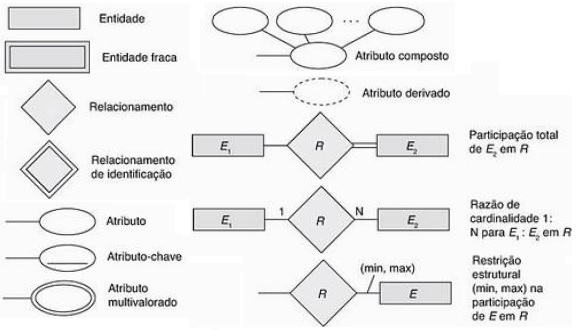
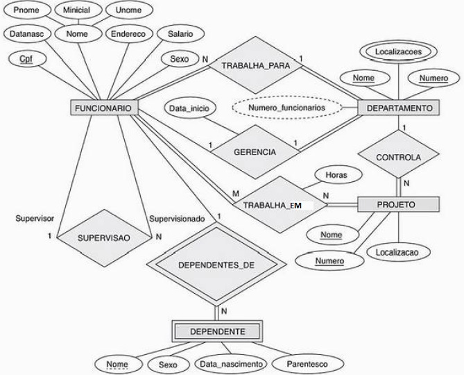

## [Tópico T11] - Modelo Entidade Relacionamento (MER) - Conceitos
###### *by Prof. Plinio Sa Leitao-Junior (INF/UFG)*

Ao empregar o Modelo Entidade Relacionamento (MER) no projeto conceitual do banco de dados, é necessário **identificar os elementos conceituais pertinentes ao banco de dados**, a partir dos requisitos de dados da aplicação. Sobre tais elementos conceituais, algumas questões são preeminentes:
1. Que elementos conceituais são categorizados como **tipo de entidade**?
1. Que elementos conceituais são categorizados como **tipo de relacionamento**?
3. Que elementos conceituais são categorizados como **atributos**?
4. Que **regras de integridade** permeiam os elementos conceituais?

>A aplicação do MER no projeto conceitual de banco de dados requer a **descoberta dos elementos conceituais e sua classificação**, a saber: *tipo de entidade*, *tipo de relacionamento*, *atributo* e *restrição de integridade*. Essa classificação dar-se-á com melhorias sucessivas, pois trata-se de um processo:
>- **Interativo.** Comunicação frequente entre projetistas, usuários e demais *stakeholders*.
>- **Iterativo.** Várias *rodadas* de desenvolvimento em grupo, com resultados intermediários e *feedbacks*.
>- **Evolutivo.** O esquema conceitual em si amadurece em decorrência da interação e da iteração.

Nosso curso envolve os primeiros esforços para: (i) o desenvolvimento de projeto conceitual de banco de dados; e (ii) o desenvolvimento de um projetista de banco de dados (o discente). O primeiro somente ocorre se o segundo ocorrer.

### Alguns Conceitos do Modelo Entidade Relacionamento (MER)

Alguns dos conceitos do MER são apresentados a seguir. Vale ressaltar que o aprendizado do MER para o projeto conceitual de banco de dados envolve o exercício prático de seus conceitos. 

- **Tipo de Entidade.** Elemento (coisa ou objeto) do mundo real com existência própria (independente). Todo tipo de entidade possui um **significado**; por exemplo, o tipo de entidade FUNCIONARIO no *BD Empresa* significa **o conjunto de funcionários** da empresa. Os tipos de entidade podem ser classificados como:
  - física: PESSOA, CARRO, CASA, FUNCIONARIO;
  - conceitual: COMPANHIA, PROFISSÃO, CURSO.
- **Entidade.** Uma instância de um tipo de entidade. Por exemplo, o 'José da Silva' e um particular 'fusca' são exemplos de entidades dos tipos PESSOA e CARRO, respectivamente.
- **Atributos [de Tipo de Entidade].** Propriedades particulares que contribuem para descrever um tipo de entidade. O tipo de entidade FUNCIONARIO é descrito pelos atributos *Nome*, *Data de Nascimento*, *Endereço*, *Salário* e *Cargo*. Uma particular entidade terá um valor para cada um de seus atributos. 
- **Domínio de Atributo.** Conjunto de valores possíveis de um atributo. Dois exemplos são: *(i)* o domínio do atributo *Estado civil* é **dom(Estado Civil) = &#123;"solteiro", "casado", ...&#125;**; e *(ii)* o domínio do atributo *Nome* do Tipo de Entidade FUNCIONARIO é **dom(FUNCIONARIO.Nome) = conjunto de cadeias de caracteres alfabéticos separados por caracteres em branco, e limitados a 40 caracteres**.
- **Valor Nulo.** Valor ausente, ou seja, nenhum valor foi atribuído ao atributo, pois o valor é desconhecido ou não aplicável. Um exemplo para o primeiro é: o valor do atributo *Data de Nascimento* não é conhecido para o 'José da Silva', o qual é uma entidade do tipo FUNCIONARIO. Um exemplo para o segundo é: o valor do atributo *Data de Pagamento* não é aplicável para uma particular fatura, que é uma entidade do tipo FATURA, pois a mesma ainda não foi paga. 
- **Atributo Composto.** Atributo que pode ser subdividido em subpartes menores, que representam atributos mais básicos, os quais possuem significados independentes. Por exemplo, o atributo *Endereço* pode ser subdividido em *Logradouro*, *Número*, *Complemento*, etc. Os atributos que não são divisíveis são chamados de **atributos simples** ou **atributos atômicos**. O valor de um atributo composto é a concatenação dos valores dos seus atributos simples (os atributos simples que o compõe). Atributos compostos são aplicáveis para *modelar situações em que o atributo composto é referenciado como uma unidade, mas seus componentes individuais são também referenciados em outras situações*.
- **Atributo Multivalorado.** Atributo que pode assumir, concomitantemente, vários valores para uma mesma entidade. Para ilustrar, o projetista de banco de dados concluiu que é importante 'conhecer' os vários números de telefone celular dos funcionários da empresa, especialmente aqueles ligados às atividades de vendas. Então, o projetista modelou o atributo *Número do Telefone Celular* como um atributo multivalorado. Então, uma dada uma entidade do tipo FUNCIONARIO (por exemplo o 'José da Silva') poderá ter seus 'vários' números de telefone celular presentes no banco de dados. 
- **Atributo Derivado.** Atributo cujo valor pode ser derivado a partir de outros componentes do esquema conceitual e, por isso, não necessitam ser armazenados no banco de dados (mas podem ser armazenados). Dois exemplos são: (i) o atributo *Idade* é um atributo derivado, pois seu valor pode ser obtido a partir do valor do atributo *Data de Nascimento*; e (ii) o atributo *Número de Dependentes* em FUNCIONARIO é um atributo derivado, pois seu valor pode ser obtido a partir da associação DEPENDENTES_DE (tipo de relacionamento) entre FUNCIONARIO e DEPENDENTE (tipos de entidade).
- **Atributo Chave.** Atributo (ou conjunto de atributos) que identifica cada entidade de um certo tipo. **Todo tipo de entidade tem um atributo chave**:
  - um exemplo, o atributo chave do tipo de entidade VEICULO é o atributo *Placa*;
  - outro exemplo, o atributo chave de MUNICIPIO é composto pelos atributos *Nome da Cidade* e *Estado*;
  - os valores do atributo chave são requeridos (não podem ser nulos) e únicos (não há repetição) dentre as entidades do Tipo de Entidade; por exemplo, duas entidades do tipo VEICULO não podem ter o mesmo valor para o atributo *Placa*.
  - podem existir vários atributos candidatos para ser o atributo chave, mas um deles deve ser o escolhido; por exemplo, os atributos *Placa*, *Renavam* e *Chassi* são candidatos em VEICULO.
  - o atributo chave deve ser mínimo, ou seja, não pode haver atributos 'supérfluos' para efeito de ser chave; por exemplo, o atributo chave de MUNICIPIO não precisaria ser composto pelos atributos *Nome da Cidade*, *Estado* e *Área*, pois somente os atributos *Nome da Cidade* e *Estado* são suficientes (o atributo *Área* seria supérfluo).
- **Tipo de Relacionamento.** Associação entre Tipos de Entidade. Todo tipo de relacionamento possui um **significado**; por exemplo, o tipo de relacionamento TRABALHA_PARA, que associa FUNCIONARIO e DEPARTAMENTO, significa que **funcionario trabalha para departamento**:
  - um tipo de relacionamento **R** entre **n** tipos de entidade **E1, E2, ..., En** define um conjunto de associações entre entidades desses tipos;
  - **n** representa o *grau do tipo de relacionamento*: se **n=2** então **R** é um *tipo de relacionamento binário*, se **n=3** então **R** é um *tipo de relacionamento ternário*; e assim por diante;
  - os tipos de relacionamento binários são os mais usuais.
- **Relacionamento.** Ocorrência (instância) de um tipo de relacionamento. Por exemplo, *o funcionário João da Silva trabalha para o departamento Recursos Humanos* é um relacionamento (uma instância de relacionamento) do tipo TRABALHA_PARA. Então, TRABALHA_PARA é um conjunto de relacionamentos (conjunto de instâncias de relacionamentos) entre FUNCIONARIO e DEPARTAMENTO , com o significado **funcionario trabalha para departamento**.
- **Atributos [de Tipo de Relacionamento].** Propriedades particulares que contribuem para descrever um tipo de relacionamento. Por exemplo, o tipo de relacionamento TRABALHA_EM, que associa FUNCIONARIO e PROJETO, possui o atributo *Horas*, o qual tem o significado **a quantidade de horas semanais que um funcionário trabalha em um projeto**. Veja que este atributo não é um atributo do tipo de entidade FUNCIONARIO, nem de PROJETO, mas um atributo da associação entre FUNCIONARIO e PROJETO, conforme o seu significado (ou seja, um atributo do tipo de relacionamento TRABALHA_EM). Um particular relacionamento terá um valor para cada um de seus atributos.
- **Restrição de Cardinalidade [em Tipo de Relacionamento].** Número máximo de instâncias de um tipo de relacionamento que uma entidade pode participar. Em tipos de relacionamento binários, as retrições de cardinalidade são **um-para-um (1:1)**, **um-para-muitos (1:N)** ou **muitos-para-muitos (N:N ou N:M)**. Por exemplo, no tipo de relacionamento TRABALHA_PARA, **a restrição de cardinalidade de DEPARTAMENTO:FUNCIONARIO é 1:N**, cujo significado é:
  - *cada departamento pode ter até (no máximo) vários funcionários que trabalham para ele*; e 
  - *cada funcionário trabalha para no máximo 1 (um) departamento*. 
- **Restrição de Participação [em Tipo de Relacionamento].** Número mínimo de instâncias de um tipo de relacionamento que uma entidade pode participar. Noutras palavras, se a existência de uma entidade depende de ela estar relacionada a outra entidade por meio do tipo de relacionamento. Uma restrição de participação pode ser **parcial** (o valor mínimo é zero, ou seja, uma entidade [de um certo tipo de entidade] pode participar ou não participar de um tipo de relacionamento) ou **total** (o valor mínimo é um, ou seja, toda entidade [de um certo tipo de entidade] deve participar de um tipo de relacionamento). Por exemplo, no tipo de ralacionamento GERENCIA, **FUNCIONARIO tem participação parcial** e **DEPARTAMENTO tem participação total**, cujo significado, respectivamente, é:
  - *pode haver funcionários que são gerentes de departamento, mas pode haver funcionários que não são gerentes de departamento*; e 
  - *todo e qualquer departamento está associado a pelo menos (no mínimo) um funcionário, que é o seu gerente*.

### Uma Notação para o Diagrama Entidade Relacionamento (DER)

Os conceitos do Modelo Entidade Relacionamento (MER) podem ser empregados para especificar o Diagrama Entidade Relacionamento (DER), que é uma **representação visual** do **esquema conceitual** do banco de dados. A seguir é introduzida uma notação para o DER, conforme posta em [1].

>***Questão:* Você consegue identificar e interpretar os conceitos do MER presentes no DER do BD Empresa (diagrama a seguir)?**

## Atividade (data limite: **24/03/2021 23h59min59s**)

Criar uma _issue_ no projeto https://github.com/plinioleitao/bes-bd-2020-2, com o título "Tópico 11", para responder:  

1. **Você consegue identificar e interpretar os conceitos do MER presentes no DER do BD Empresa?** Favor selecionar uma das respostas a seguir:
   - "Sim, eu consigo identificar e interpretar os conceitos do MER presentes no DER do BD Empresa", ou
   - "Não, pois eu tenho dificuldade para identificar (ou interpretar), no DER do BD Empresa, os seguintes conceitos do MER: blá, blá, ...". Nesta resposta, você deve descrever as suas dificuldades, em vez de apenas listá-las.
1. Dentre as sentenças abaixo sobre o DER do BD Empresa, descubra quais das sentenças são falsas (responda somente com o somatório dos números das sentenças falsas). 
**(01)** Um funcionário pode ter de zero a vários supervisores. 
**(02)** Um funcionário pode ter de zero a vários supervisionados. 
**(04)** A associação do tipo de entidade DEPENDENTE no tipo de relacionamento DEPENDENTES_DE possui valores máximo e mínimo iguais a 1. 
**(08)** Um projeto deve ser controlado por um departamento, o qual necessariamente possui funcionários que trabalham neste projeto. 
**(16)** O tipo de relacionamento TRABALHA_PARA possui cardinalidade um-para-muitos, onde o tipo de entidade FUNCIONARIO possui participação total.
1. Dentre as sentenças abaixo, descubra quais são as verdadeiras (responda somente com o somatório dos números das sentenças verdadeiras). 
**(01)** Um tipo de entidade pode participar de, no máximo, 05 tipos de relacionamento. 
**(02)** Em um tipo de relacionamento binário com cardinalidade muitos-para-muitos, há pelo menos um tipo de entidade com participação total. 
**(04)** Um tipo de entidade não pode possuir mais de um atributo candidato a atributo chave. 
**(08)** Um tipo de entidade, que participa de dois ou mais tipos de relacionamento, deve ter participação parcial em pelo menos um desses tipo de relacionamento. 
**(16)** Um tipo de entidade fraca possui, necessariamente, participação total no tipo de relacionamento de identificação.

## Artefatos

1. _Issue_ criada no projeto https://github.com/plinioleitao/bes-bd-2020-2, cujo título é "Tópico 11", para indicar suas reflexões iniciais sobre *os conceitos do Modelo Entidade Relacionamento (MER)*.

### Bibliografia

[1] ELMASRI, R.; NAVATHE, S. B. Sistemas de Banco de Dados. 6. ed. Pearson, 2011.
